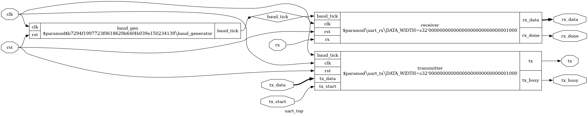

# uart-rtl-to-gdsii
<div align="center">

# RTL-to-GDSII Implementation of a UART IP Core using OpenLane2

### 🚀 Complete Open-Source ASIC Design Flow from Verilog RTL to Fabrication-Ready GDSII

<p align="center">


</p>

<p align="center">


</p>

</div>

---

## 📄 Project Report

The complete project report is available here:

📘 [UART RTL-to-GDSII Report](reports/UART_RTL_to_GDSII_Report.pdf)


# 📖 Project Overview

This repository presents the **complete RTL-to-GDSII implementation of a Universal Asynchronous Receiver-Transmitter (UART) IP Core** using the **OpenLane2 open-source ASIC design flow** and the **SkyWater SKY130 Process Design Kit (PDK)**.

The project demonstrates the complete digital ASIC design methodology beginning with **Register Transfer Level (RTL)** design in **Verilog HDL** and ending with a **fabrication-ready GDSII layout**. Every major stage of the ASIC implementation flow has been carried out using open-source Electronic Design Automation (EDA) tools, including functional verification, logic synthesis, floorplanning, placement, clock tree synthesis, routing, timing analysis, parasitic extraction, physical verification, and final signoff.

The UART IP core was designed using a modular architecture consisting of a **Baud Rate Generator**, **UART Transmitter**, **UART Receiver**, and a **Top-Level Integration Module**. The complete design was verified using simulation before being implemented through the OpenLane2 automated RTL-to-GDSII flow.

---

# ✨ Project Features

- ✔️ Modular UART IP Core written in Verilog HDL
- ✔️ Functional verification using dedicated testbenches
- ✔️ RTL schematics generated using Yosys
- ✔️ Complete RTL-to-GDSII implementation using OpenLane2
- ✔️ Logic synthesis using Yosys
- ✔️ Automated floorplanning and placement using OpenROAD
- ✔️ Clock Tree Synthesis (CTS)
- ✔️ Global and Detailed Routing
- ✔️ RC Extraction (OpenRCX)
- ✔️ Static Timing Analysis (OpenSTA)
- ✔️ IR-Drop Analysis
- ✔️ Design Rule Checking (Magic)
- ✔️ Layout Versus Schematic Verification (Netgen)
- ✔️ Manufacturability Verification
- ✔️ Final GDSII Layout Generation

---

# 🛠️ Design Flow

```
Verilog RTL
      │
      ▼
RTL Simulation
      │
      ▼
RTL Verification
      │
      ▼
Logic Synthesis
      │
      ▼
Floorplanning
      │
      ▼
Placement
      │
      ▼
Clock Tree Synthesis
      │
      ▼
Routing
      │
      ▼
RC Extraction
      │
      ▼
Static Timing Analysis
      │
      ▼
Physical Verification
      │
      ▼
Final GDSII Layout
```

---

# 📑 Table of Contents

- [Project Overview](#-project-overview)
- [Project Features](#-project-features)
- [Repository Structure](#-repository-structure)
- [UART Protocol Overview](#-uart-protocol-overview)
- [System Architecture](#-system-architecture)
- [RTL Modules](#-rtl-modules)
- [RTL Schematics](#-rtl-schematics)
- [Functional Verification](#-functional-verification)
- [OpenLane2 RTL-to-GDSII Flow](#-openlane2-rtl-to-gdsii-flow)
- [Physical Design Results](#-physical-design-results)
- [Physical Verification](#-physical-verification)
- [Final GDSII Layout](#-final-gdsii-layout)
- [Project Statistics](#-project-statistics)
- [Tools Used](#-tools-used)
- [How to Run](#-how-to-run)
- [Future Improvements](#-future-improvements)
- [License](#-license)
- [Author](#-author)

- # 📁 Repository Structure

```text
uart-rtl-to-gdsii
│
├── rtl/                        # Verilog HDL source files
│   ├── uart_top.v
│   ├── uart_tx.v
│   ├── uart_rx.v
│   └── baud_generator.v
│
├── tb/                         # Testbenches
│   ├── tb_uart_top.v
│   ├── tb_uart_tx.v
│   ├── tb_uart_rx.v
│   └── tb_baud_generator.v
│
├── waveforms/                  # Simulation waveforms (.vcd)
│
├── images/                     # Architecture, RTL, OpenLane screenshots
│
├── reports/                    # Final project report (PDF)
│
├── config.json                 # OpenLane2 configuration
│
├── README.md
│
└── LICENSE
```

---

# 📡 UART Protocol Overview

The **Universal Asynchronous Receiver-Transmitter (UART)** is one of the most widely used asynchronous serial communication protocols in embedded systems, microcontrollers, and System-on-Chip (SoC) designs. Unlike synchronous interfaces, UART does not require a dedicated clock line. Instead, both the transmitter and receiver operate using a pre-configured baud rate.

UART communication transmits data sequentially over a single communication line using a predefined frame format.

A standard UART frame consists of:

```
Idle → Start Bit → Data Bits → (Optional Parity) → Stop Bit
```

Typical UART Frame:

```
 ─────┐_______________________________________________┐────────
      │                                               │
      ▼                                               ▼

      Start      D0 D1 D2 D3 D4 D5 D6 D7      Stop

        0         x  x  x  x  x  x  x  x        1
```

### UART Characteristics

| Parameter | Value |
|-----------|-------|
| Communication Type | Asynchronous |
| Data Width | 8-bit |
| Start Bits | 1 |
| Stop Bits | 1 |
| Parity | Not Implemented |
| Duplex Mode | Full Duplex |
| RTL Language | Verilog HDL |

---

# 🏗 System Architecture

The UART IP core has been designed using a modular architecture. Each functional block performs a dedicated task while communicating with other modules through well-defined interfaces. This modular design simplifies verification, improves readability, and enables future scalability.

<p align="center">

</p>

<p align="center">
<b>Figure 1.</b> Overall architecture of the UART IP Core.
</p>

The complete UART system consists of four RTL modules:

| Module | Function |
|---------|----------|
| Baud Rate Generator | Generates baud tick from system clock |
| UART Transmitter | Converts parallel data into serial UART frames |
| UART Receiver | Converts serial UART frames back to parallel data |
| UART Top Module | Integrates all submodules into a complete UART IP |

---

# 🧩 RTL Modules

## 1️⃣ Baud Rate Generator

The Baud Rate Generator divides the high-frequency system clock to generate the baud tick required by both the transmitter and receiver. This ensures synchronized serial communication without requiring a dedicated external clock.

### Features

- Configurable baud divisor
- Counter-based implementation
- Generates periodic baud tick
- Shared by TX and RX modules

<p align="center">

</p>

---

## 2️⃣ UART Transmitter

The UART transmitter accepts parallel data and serializes it according to the UART communication protocol. Transmission begins with a start bit, followed by eight data bits, and finally a stop bit.

### Features

- FSM-based implementation
- Parallel-to-Serial conversion
- Start and Stop bit generation
- Busy signal generation

<p align="center">

</p>

---

## 3️⃣ UART Receiver

The UART receiver samples incoming serial data at baud-rate intervals and reconstructs the transmitted byte. After receiving all bits, the received data is presented on the output bus.

### Features

- FSM-based implementation
- Serial-to-Parallel conversion
- Start bit detection
- Stop bit verification
- Receive complete indication

<p align="center">

</p>

---

## 4️⃣ UART Top Module

The top-level module integrates the Baud Generator, UART Transmitter, and UART Receiver into a complete UART communication system.

Responsibilities include:

- Clock distribution
- Baud tick distribution
- Module interconnection
- External interface management

<p align="center">

</p>

---

# ⚙ Design Specifications

| Specification | Value |
|--------------|-------|
| RTL Language | Verilog HDL |
| Design Style | Synchronous Digital Logic |
| Communication Protocol | UART |
| Data Width | 8 bits |
| Clock | System Clock |
| Technology | SkyWater SKY130 PDK |
| ASIC Flow | OpenLane2 |
| Final Output | GDSII Layout |

---

# 🔷 RTL Schematics

RTL schematics were generated using **Yosys** after successful elaboration of each Verilog module. These schematics provide a structural representation of the synthesized RTL and help visualize the interconnection between logic blocks before technology mapping.

---

## 🔹 Baud Rate Generator RTL

<p align="center">

</p>

<p align="center">
<b>Figure 2.</b> RTL schematic of the Baud Rate Generator generated using Yosys.
</p>

The Baud Rate Generator consists of a counter-based clock divider that produces periodic baud ticks used by both the transmitter and receiver modules.

---

## 🔹 UART Transmitter RTL

<p align="center">

</p>

<p align="center">
<b>Figure 3.</b> RTL schematic of the UART Transmitter.
</p>

The transmitter implements a finite state machine (FSM) responsible for transmitting the UART frame in the correct sequence, including the start bit, data bits, and stop bit.

---

## 🔹 UART Receiver RTL

<p align="center">

</p>

<p align="center">
<b>Figure 4.</b> RTL schematic of the UART Receiver.
</p>

The receiver detects the start bit, samples incoming serial data using the baud tick, reconstructs the transmitted byte, and indicates successful reception.

---

## 🔹 UART Top RTL

<p align="center">

</p>

<p align="center">
<b>Figure 5.</b> RTL schematic of the complete UART Top module.
</p>

The top-level RTL integrates all functional modules into a complete UART IP core, including clock distribution, baud generation, data transmission, and data reception.

---

# 📊 Functional Verification

Each RTL module was verified independently using dedicated Verilog testbenches before system-level integration. Simulation waveforms were generated to validate correct functionality under different operating conditions.

---

## 🔹 Baud Rate Generator Simulation

<p align="center">

</p>

<p align="center">
<b>Figure 6.</b> Simulation waveform of the Baud Rate Generator.
</p>

### Verification Summary

- ✔️ Clock divider operates correctly
- ✔️ Baud tick generated periodically
- ✔️ Counter resets correctly
- ✔️ Stable timing behavior observed

---

## 🔹 UART Transmitter Simulation

<p align="center">

</p>

<p align="center">
<b>Figure 7.</b> UART Transmitter simulation waveform.
</p>

### Verification Summary

- ✔️ Start bit generated correctly
- ✔️ 8-bit parallel data serialized correctly
- ✔️ Stop bit transmitted successfully
- ✔️ Busy signal asserted during transmission

---

## 🔹 UART Receiver Simulation

<p align="center">

</p>

<p align="center">
<b>Figure 8.</b> UART Receiver simulation waveform.
</p>

### Verification Summary

- ✔️ Start bit detected successfully
- ✔️ Serial data sampled correctly
- ✔️ Parallel output reconstructed accurately
- ✔️ Receive-complete signal asserted

---

## 🔹 UART Top Simulation

<p align="center">

</p>

<p align="center">
<b>Figure 9.</b> Complete UART Top simulation waveform.
</p>

### Verification Summary

- ✔️ Successful end-to-end UART communication
- ✔️ Correct interaction between TX and RX modules
- ✔️ Shared baud generator operation verified
- ✔️ Correct data transmission and reception

---

# 📈 RTL Verification Summary

| Module | Status |
|---------|--------|
| Baud Rate Generator | ✅ Passed |
| UART Transmitter | ✅ Passed |
| UART Receiver | ✅ Passed |
| UART Top Module | ✅ Passed |

All RTL modules successfully passed functional verification before entering the ASIC implementation flow.

---

# 🚀 OpenLane2 RTL-to-GDSII Implementation

After functional verification, the UART IP core was implemented using the **OpenLane2** open-source ASIC flow targeting the **SkyWater SKY130 Process Design Kit (PDK)**. The complete RTL-to-GDSII flow was executed on Ubuntu (WSL2) using OpenLane2, OpenROAD, and associated open-source EDA tools.

The implementation flow automatically performed synthesis, floorplanning, placement, clock tree synthesis, routing, parasitic extraction, timing analysis, and physical verification, resulting in a fabrication-ready GDSII layout.

---

## 🔄 OpenLane2 Design Flow

<p align="center">

</p>

<p align="center">
<b>Figure 10.</b> Complete OpenLane2 RTL-to-GDSII ASIC Design Flow.
</p>

---

# 🔹 RTL Synthesis

Logic synthesis was performed using **Yosys**, where the Verilog RTL was optimized and mapped to the **SkyWater SKY130 HD Standard Cell Library**.

### Synthesis Summary

| Parameter | Value |
|-----------|------:|
| Technology Library | SKY130 HD |
| Standard Cells | 219 |
| Sequential Cells | 55 |
| Cell Area | 2539.936 µm² |
| Status | ✅ Successful |

The synthesized netlist served as the input for the subsequent physical implementation stages.

---

# 🏗 Floorplanning

The floorplanning stage defines the chip dimensions, core utilization, placement rows, and I/O pin locations before standard-cell placement.

<p align="center">

</p>

<p align="center">
<b>Figure 11.</b> Generated floorplan using OpenROAD.
</p>

### Floorplanning Results

| Metric | Value |
|--------|------:|
| Die Area | 7658.18 µm² |
| Core Area | 5009.80 µm² |
| Standard Cell Area | 3210.58 µm² |
| Core Utilization | 64.09% |
| Design Instances | 375 |

✔️ Floorplanning completed successfully.

---

# 📍 Global & Detailed Placement

During placement, OpenROAD determined the physical locations of all standard cells while minimizing wirelength and preserving timing quality.

<p align="center">

</p>

<p align="center">
<b>Figure 12.</b> Standard-cell placement after legalization.
</p>

### Placement Statistics

| Metric | Value |
|--------|------:|
| HPWL Before Optimization | 3351.5 µm |
| HPWL After Optimization | 3207.2 µm |
| HPWL Improvement | 4.3% |
| Total Displacement | 0 µm |
| Average Displacement | 0 µm |
| Maximum Displacement | 0 µm |

✔️ Placement legalized successfully with zero displacement.

---

# ⏱ Clock Tree Synthesis (CTS)

Clock Tree Synthesis (CTS) inserts clock buffers and inverters to distribute the clock signal while minimizing skew and insertion delay.

<p align="center">

</p>

<p align="center">
<b>Figure 13.</b> Clock Tree Synthesis stage.
</p>

### CTS Summary

| Metric | Value |
|--------|------:|
| Clock Nets | 6 |
| Clock Buffers | 5 |
| Clock Inverters | 3 |
| Timing Repair Buffers | 78 |
| Total Cell Area | 3405.77 µm² |

✔️ Clock tree generated successfully.

---

# 🛣 Global & Detailed Routing

Routing establishes all signal interconnections between placed cells while satisfying the SKY130 design rules.

<p align="center">

</p>

<p align="center">
<b>Figure 14.</b> Final routed layout.
</p>

### Routing Results

| Metric | Value |
|--------|------:|
| Routed Nets | 314 |
| Total Wirelength | 8404 µm |
| Total Vias | 1804 |
| Routing Utilization | 14.71% |
| Routing Overflow | 0 |
| Antenna Violations | 0 |

✔️ Routing completed without congestion or overflow.

---

# 📈 Physical Design Summary

| Stage | Status |
|--------|--------|
| RTL Synthesis | ✅ Passed |
| Floorplanning | ✅ Passed |
| Placement | ✅ Passed |
| Clock Tree Synthesis | ✅ Passed |
| Global Routing | ✅ Passed |
| Detailed Routing | ✅ Passed |

The OpenLane2 implementation successfully transformed the synthesizable RTL into a routed ASIC layout while satisfying all physical implementation constraints.

---

# 🔬 Physical Verification and Signoff

After routing, the generated layout was subjected to a complete physical verification flow to ensure correctness, manufacturability, and fabrication readiness.

---

## 📐 RC Extraction

Parasitic resistance and capacitance were extracted using **OpenRCX** to generate SPEF files for accurate post-layout timing analysis.

### Generated Files

| Operating Corner | Output |
|-----------------|--------|
| Minimum | `uart_top.min.spef` |
| Typical | `uart_top.nom.spef` |
| Maximum | `uart_top.max.spef` |

✔️ RC Extraction completed successfully.

---

## ⏱ Static Timing Analysis (STA)

Static Timing Analysis was performed using **OpenSTA** with the extracted parasitic information.

### Timing Status

| Check | Result |
|--------|--------|
| Setup Analysis | ✅ Passed |
| Hold Analysis | ✅ Passed |
| Multi-Corner Timing | ✅ Completed |

The post-layout timing analysis confirmed successful timing closure for the implemented UART IP core.

---

# ⚡ IR-Drop Analysis

Power integrity verification was carried out to evaluate voltage drop across the power distribution network.

<p align="center">

</p>

<p align="center">
<b>Figure 15.</b> IR-drop analysis results.
</p>

### IR-Drop Summary

| Parameter | VPWR | VGND |
|-----------|------|------|
| Worst Voltage | 1.79984 V | 0.000233 V |
| Average IR Drop | 0.0000416 V | 0.0000400 V |
| Worst IR Drop | 0.0001605 V | 0.0002330 V |
| Percentage Drop | 0.01% | 0.01% |

✔️ Negligible voltage drop observed.

---

# ✔️ Design Rule Checking (Magic)

The routed layout was verified using **Magic** to ensure compliance with the SKY130 design rules.

<p align="center">

</p>

<p align="center">
<b>Figure 16.</b> Magic DRC verification.
</p>

### DRC Summary

| Metric | Result |
|--------|--------|
| DRC Violations | 0 |
| Status | ✅ PASS |

The layout successfully passed all design rule checks without any violations.

---

# ✔️ Layout Versus Schematic (Netgen LVS)

Netgen was used to compare the extracted layout netlist with the synthesized gate-level netlist.

<p align="center">

</p>

<p align="center">
<b>Figure 17.</b> Netgen LVS verification.
</p>

### LVS Summary

| Check | Status |
|-------|--------|
| Layout Matches Schematic | ✅ PASS |
| LVS Verification | ✅ PASS |

The physical layout is logically equivalent to the synthesized RTL netlist.

---

# 🏭 Manufacturability Report

The final manufacturability report summarizes all signoff verification stages.

<p align="center">

</p>

<p align="center">
<b>Figure 18.</b> Manufacturability verification report.
</p>

### Verification Summary

| Verification | Status |
|-------------|--------|
| Antenna Check | ✅ PASS |
| Magic DRC | ✅ PASS |
| Netgen LVS | ✅ PASS |
| Manufacturability | ✅ PASS |

The UART layout satisfies the manufacturability requirements of the SKY130 process.

---

# 🖥 Final GDSII Layout

The verified design was exported as a fabrication-ready GDSII layout.

<p align="center">

</p>

<p align="center">
<b>Figure 19.</b> Final GDSII layout viewed in KLayout.
</p>

The final layout successfully completed the entire RTL-to-GDSII implementation flow using OpenLane2.

---

# 📊 Overall Project Statistics

| Category | Value |
|----------|-------|
| RTL Language | Verilog HDL |
| Communication Protocol | UART |
| Technology | SkyWater SKY130 PDK |
| ASIC Flow | OpenLane2 |
| Logic Synthesis | Yosys |
| Physical Design | OpenROAD |
| RC Extraction | OpenRCX |
| Timing Analysis | OpenSTA |
| DRC | Magic |
| LVS | Netgen |
| Layout Viewer | KLayout |
| RTL Modules | 4 |
| Testbenches | 4 |
| Final Output | Fabrication-ready GDSII |

---

# 🛠 Tools Used

| Tool | Purpose |
|------|---------|
| Verilog HDL | RTL Design |
| Yosys | Logic Synthesis |
| OpenLane2 | RTL-to-GDSII Flow |
| OpenROAD | Physical Design |
| OpenRCX | RC Extraction |
| OpenSTA | Static Timing Analysis |
| Magic | Design Rule Checking |
| Netgen | Layout Versus Schematic |
| KLayout | Layout Visualization |
| GTKWave | Waveform Analysis |
| Ubuntu (WSL2) | Development Environment |

---

# ▶️ How to Run

### Clone the Repository

```bash
git clone https://github.com/shivam-du/uart-rtl-to-gdsii.git

cd uart-rtl-to-gdsii
```

### RTL Simulation

```bash
iverilog -o uart_top_tb rtl/*.v tb/tb_uart_top.v

vvp uart_top_tb

gtkwave waveforms/uart_top.vcd
```

### OpenLane2 Flow

```bash
openlane config.json
```

> **Note:** Ensure that OpenLane2 and the SKY130 PDK are correctly installed before running the physical design flow.

---

# 🚀 Future Improvements

- Add configurable parity support.
- Support multiple stop-bit configurations.
- Implement configurable baud rates.
- Add transmit and receive FIFOs.
- Integrate APB or AXI-Lite interfaces.
- Prototype on FPGA before fabrication.
- Integrate the UART IP into a larger System-on-Chip (SoC).

---

# 📚 References

- OpenLane2 Documentation
- OpenROAD Documentation
- SkyWater SKY130 PDK Documentation
- Yosys Documentation
- Magic VLSI Documentation
- Netgen Documentation
- OpenSTA Documentation

---

# 👨‍💻 Author

**Shivam Chaurasiya**

B.Tech – Electronics and Communication Engineering

**Areas of Interest**

- VLSI Design
- ASIC Physical Design
- Digital IC Design
- Semiconductor Technology
- RTL Design
- Open-Source EDA

---

# 📄 License

This project is licensed under the **MIT License**.

See the `LICENSE` file for more details.

---

<div align="center">

## ⭐ If you found this project useful, consider giving it a star!

**Thank you for visiting this repository.**

</div>
